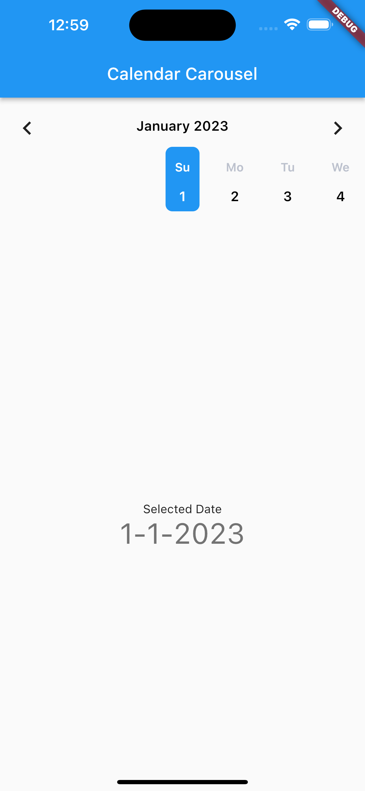

# Calendar Carousel

A custom widget that display calendar in a form of carousel slider.

## Installation

Add `carousel_calendar: ^0.0.1` to your `pubspec.yaml` dependencies. And import it:

```dart
import 'package:carousel_calendar/carousel_calendar.dart';
```

## Features

* Display calendar in a form of carousel
* Listen to the unchanged events for the dates.


## Supported platforms

* Flutter Android
* Flutter iOS
* Flutter web
* Flutter desktop

## Usage

Simply create a `CalendarCarousel` widget, and pass the params according to your customization:

```dart
import 'flutter/material.dart';
import 'package:dp_widget/dp_widget.dart';

class SamplePage extends StatefulWidget {
  const SamplePage({Key? key, required this.title}) : super(key: key);
  final String title;

  @override
  State<SamplePage> createState() => _SamplePageState();
}

class _SamplePageState extends State<SamplePage> {
  final GlobalKey<ScaffoldState> _scaffoldKey = GlobalKey();
  DateTime? date;
  
  @override
  Widget build(BuildContext context) {
    return Scaffold(
        key: _scaffoldKey,
        appBar: AppBar(
          title: Text(widget.title),
        ),
        body: Center(
        child: Padding(
            padding: const EdgeInsets.all(8.0),
            child: Column(
              mainAxisAlignment: MainAxisAlignment.start,
              children: [
                Padding(
                  padding: const EdgeInsets.all(8.0),
                  child: CalendarCarousel(
                    monthSelectorMargin: EdgeInsets.only(bottom: 2.0),
                    weekdayMargin: EdgeInsets.symmetric(vertical: 12.0),
                    weekdayAbb: WeekdayAbbreviation.two,
                    dayCarouselHeight: 120,
                    showYearAlways: true,
                    onChanged: (nm) {
                      setState(() {
                        date = nm;
                      });
                    },
                  ),
                ),
                Expanded(
                  child: Column(
                    mainAxisAlignment: MainAxisAlignment.center,
                    children: <Widget>[
                      const Text(
                        'Selected Date',
                      ),
                      Text(
                        '${date != null ? "${date!.day}-${date!.month}-${date!.year}" : "No selection yet."}',
                        style: Theme.of(context).textTheme.headlineMedium,
                      ),
                    ],
                  ),
                ),
              ],
            ),
    ),),);
    }
}

```

## Screenshot



The screenshots above can be found at the example project.

## License

MIT
